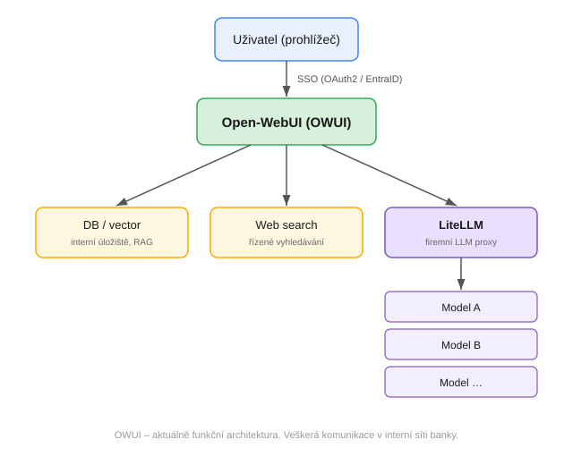
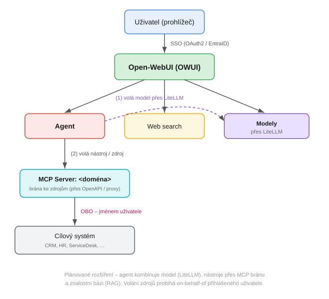
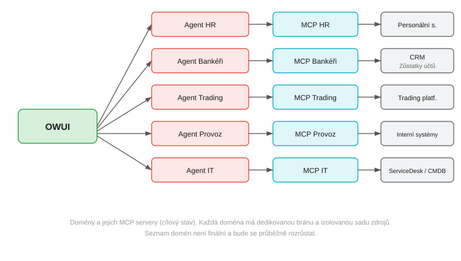

# Architektura OWUI

## Přehled

OWUI funguje jako centrální AI hub banky – jednotné místo přístupu k jazykovým modelům a specializovaným agentům. Veškerá komunikace probíhá v interní síti banky.

## Komponenty

### Aktuálně funkční

- **DB / vector** – interní úložiště OWUI (uživatelská data, historie, vektorová DB pro RAG)
- **Web search** – řízený nástroj pro vyhledávání na webu
- **LiteLLM** – firemní LLM proxy; **jediný vstupní bod ke všem modelům** (i pro agenty)

### Plánované rozšíření – agenti a přístup ke zdrojům

Agent kombinuje:
- volání modelu přes LiteLLM
- volání externích nástrojů/zdrojů přes doménový MCP server
- znalostní bázi (RAG) v interním úložišti

Volání zdrojů přes MCP probíhá **on behalf of** přihlášeného uživatele – viz [`pristup-ke-zdrojum.md`](pristup-ke-zdrojum.md).

> **Pozn. k diagramům:** "MCP server" v diagramech označuje doménovou bránu ke zdrojům logicky. OWUI dnes nativně nevolá MCP přímo – fyzicky se počítá s vrstvou OpenAPI Tool Servers, případně s MCP-to-OpenAPI proxy. Volba konkrétního mechanismu je otevřená otázka, viz [`pristup-ke-zdrojum.md`](pristup-ke-zdrojum.md).

### Domény a jejich MCP servery (cílový stav)

Detail per doména viz [`agenti.md`](agenti.md).

## Řízení přístupu

Přístup je řízen na dvou úrovních prostřednictvím AD skupin:

1. **Přístup k modelům** – členství v AD skupině opravňuje k použití konkrétního modelu nebo sady modelů
2. **Přístup k agentům** – členství v AD skupině business domény zpřístupňuje agenty dané domény

Jeden uživatel může být členem více skupin obou dimenzí. Detailní popis viz [`role-a-skupiny.md`](role-a-skupiny.md).

## Identita a autentizace

- Přihlašování výhradně přes **SSO – Microsoft EntraID (AAD)**
- Po přihlášení OWUI zná identitu uživatele a jeho skupinové členství
- Identita je předávána při volání MCP serverů (OBO flow) – viz [`pristup-ke-zdrojum.md`](pristup-ke-zdrojum.md)

## Stav komponent

| Komponenta | Stav | Poznámka |
|---|---|---|
| OWUI | ✅ funkční | |
| LiteLLM proxy | ✅ funkční | |
| SSO / EntraID | ✅ funkční | |
| Web search | ✅ funkční | |
| Interní úložiště (DB, vector DB) | ✅ funkční | součást nasazení OWUI |
| Agenti per doména | 🔧 v přípravě | |
| MCP servery | 🔧 koncept | viz otevřené otázky v `pristup-ke-zdrojum.md` |
| Řízení přístupu přes AD skupiny | 🔧 v přípravě | |
